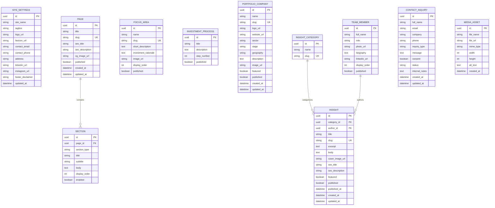

# PRD + ERD — AzHcriel Capital Investment Fund
## Company Profile Landing Page — AI Build Specification

> **Purpose:** This document is a production-ready PRD, ERD, and implementation prompt for an AI coding agent to build a modern company-profile landing page for **AzHcriel Capital Investment Fund**, based on the supplied visual references.
>
> **Reference assets supplied by the client:** `78030.jpg` (logo artwork) and `78029.jpg` (logo applied as a building/signage mockup).

---

# 1. Product Overview

## 1.1 Product Name

**AzHcriel Capital Investment Fund — Corporate Website**

## 1.2 Product Type

Premium corporate profile / investment fund landing page with optional lightweight CMS and lead-management capability.

## 1.3 Primary Goal

Build a trustworthy, premium, institutional-looking website that introduces AzHcriel Capital Investment Fund, communicates its investment philosophy, showcases focus areas/portfolio, and provides a clear path for prospective investors, founders, partners, and other stakeholders to contact the company.

## 1.4 Design Direction

The visual identity should be derived from the supplied logo:

- Primary visual language: **dark green + near-black + white**
- Green communicates growth, capital, progress, and upward momentum.
- Black communicates authority, stability, and institutional credibility.
- White/off-white provides premium negative space.
- Logo motif consists of angular upward-moving forms/arrows.
- Overall feeling: **institutional, modern, confident, minimal, premium**.
- Avoid overly playful startup aesthetics.
- Avoid excessive gradients, glassmorphism, neon colors, or generic SaaS visuals.
- Use generous whitespace and strong typography.
- Use subtle motion rather than flashy animation.

## 1.5 Important Content Constraint

Do **not** invent factual company claims, AUM figures, portfolio companies, regulatory licenses, offices, investment returns, founders, awards, or client names.

Where actual company information has not been supplied, use clearly marked CMS placeholders such as:

- `[COMPANY DESCRIPTION]`
- `[INVESTMENT THESIS]`
- `[TEAM MEMBER]`
- `[PORTFOLIO COMPANY]`
- `[CONTACT EMAIL]`
- `[OFFICE ADDRESS]`

The CMS/admin layer should make these values easy to replace later.

---

# 2. Target Users

## Primary Audiences

1. **Potential Investors**
   - Wants to understand who the firm is, its investment approach, credibility, and how to contact the team.

2. **Founders / Investment Opportunities**
   - Wants to understand the fund's investment focus and submit an opportunity.

3. **Strategic Partners**
   - Wants a quick overview of the firm and its areas of activity.

4. **General Visitors**
   - Wants a credible company profile, contact information, and a professional first impression.

---

# 3. Business Objectives

The website should:

- Establish a credible digital presence.
- Explain the firm's investment philosophy clearly.
- Communicate investment focus and differentiation.
- Present selected portfolio/investment areas when data is available.
- Generate qualified inquiries.
- Provide direct contact options.
- Be responsive across mobile, tablet, and desktop.
- Be SEO-friendly.
- Be fast and accessible.
- Allow non-developers to update key corporate content if a CMS is implemented.

---

# 4. MVP Scope

## In Scope

### Public Website

1. Home
2. About / Firm
3. Investment Philosophy
4. Focus Areas / Strategy
5. Portfolio / Investments
6. Team
7. Insights / News
8. Contact
9. Legal / Privacy pages
10. Responsive navigation
11. Contact/inquiry form
12. SEO metadata
13. Social sharing metadata
14. Analytics integration hooks
15. Basic CMS/data model

### Optional Phase 2

- Investor login area
- Secure document room
- Downloadable investor reports
- Newsletter subscription
- Advanced portfolio filtering
- Multi-language support
- Admin dashboard
- CRM integration
- Investor inquiry workflow
- Blog categories/tags
- Search
- Appointment scheduling

---

# 5. Information Architecture

```text
/
├── Home
├── About
├── Strategy
│   ├── Investment Philosophy
│   ├── Focus Areas
│   └── Approach / Process
├── Portfolio
├── Team
├── Insights
│   └── Insight Detail
├── Contact
├── Privacy Policy
└── Terms / Disclaimer
```

---

# 6. Landing Page Structure

## 6.1 Header

### Content

- Logo
- Navigation:
  - About
  - Strategy
  - Portfolio
  - Team
  - Insights
  - Contact
- Primary CTA: **Contact Us**

### Behavior

- Transparent/overlay header on hero where appropriate.
- Becomes solid/light or dark-on-scroll depending on section background.
- Sticky on desktop.
- Mobile hamburger navigation.
- Smooth scroll for same-page sections if the site is implemented as a single landing page.

---

# 7. Hero Section

## Objective

Immediately communicate an institutional investment brand with a strong visual identity.

### Suggested content structure

**Eyebrow**
> AZHCRIEL CAPITAL

**Headline**
> Building Long-Term Value Through Disciplined Capital

**Supporting text**
> `[SHORT COMPANY POSITIONING STATEMENT]`

**CTA**
- Explore Our Approach
- Contact Us

### Visual

Use the supplied logo as the central brand asset.

Possible hero treatments:

- Large architectural/logo composition.
- Dark green background with black/white typography.
- Editorial-style photography of architecture, finance, business, or city infrastructure.
- Large typographic treatment with the angular upward motif echoed subtly in the background.

### Motion

- Very subtle logo reveal.
- Slow geometric movement.
- Text fade/slide.
- Respect `prefers-reduced-motion`.

---

# 8. About Section

## Objective

Explain the firm in a concise institutional manner.

### Content

- Company overview
- Mission
- Vision
- Core values
- Optional firm facts

### Example layout

```text
[Large statement]

We invest with a long-term perspective,
disciplined underwriting, and a focus on
sustainable value creation.

[Supporting copy]

[Mission] [Vision] [Values]
```

All factual content should be CMS-driven.

---

# 9. Investment Philosophy Section

## Objective

Explain why the firm invests and how it evaluates opportunities.

### Suggested cards

1. **Long-Term Perspective**
2. **Disciplined Underwriting**
3. **Value Creation**
4. **Strategic Partnership**

These are proposed content structures, not verified company claims. Replace with approved company messaging.

### UX

- Four premium cards.
- Minimal iconography.
- Strong typographic hierarchy.
- Hover interaction on desktop.
- Stacked cards on mobile.

---

# 10. Strategy / Focus Areas

## Objective

Show where the company focuses its capital.

### Data-driven structure

Each strategy/focus area should contain:

- Name
- Short description
- Image
- Investment rationale
- Optional metrics
- Display order

### Example placeholders

```text
[FOCUS AREA 01]
[FOCUS AREA DESCRIPTION]

[FOCUS AREA 02]
[FOCUS AREA DESCRIPTION]

[FOCUS AREA 03]
[FOCUS AREA DESCRIPTION]
```

Do not invent sectors until approved.

---

# 11. Investment Process

Recommended visual timeline:

```text
01 — Identify
02 — Evaluate
03 — Structure
04 — Partner
05 — Create Value
```

Each stage:

- Number
- Title
- Description
- Optional icon

The exact process must be replaceable through CMS.

---

# 12. Portfolio / Investments

## Objective

Provide credibility and demonstrate investment activity where disclosure is permitted.

### Portfolio Card

Fields:

- Company name
- Logo
- Short description
- Sector
- Investment stage
- Geography
- Website URL
- Featured image
- Featured status

### Privacy / Disclosure

Only publish portfolio information explicitly approved for public disclosure.

### Empty State

If there are no approved public portfolio records:

> `Selected investments will be presented here as they become available for public disclosure.`

---

# 13. Team Section

## Objective

Humanize the institution and establish credibility.

### Team Card

- Portrait
- Full name
- Position
- Short biography
- LinkedIn URL (optional)
- Display order

Do not fabricate names or biographies.

### Layout

- Editorial grid
- 2–4 columns desktop
- 1–2 columns mobile
- Minimal hover interaction

---

# 14. Insights / News

## Objective

Create a scalable content area for thought leadership and SEO.

### Insight fields

- Title
- Slug
- Excerpt
- Body
- Cover image
- Author
- Category
- Published date
- Updated date
- Featured
- SEO title
- SEO description

### Card UI

```text
[Image]
CATEGORY
Insight Title
Short excerpt
Read More →
```

---

# 15. Contact Section

## Objective

Convert visitors into qualified inquiries.

### Contact information

CMS-controlled:

- Email
- Phone
- Address
- Office hours
- LinkedIn
- Other approved social profiles

### Form

Fields:

- Full name *
- Email *
- Company
- Phone
- Inquiry type *
- Message *
- Consent checkbox *

Inquiry types:

- Investor
- Founder / Investment Opportunity
- Partnership
- Media
- General
- Other

### Validation

- Required fields must be validated client-side and server-side.
- Email must use valid format.
- Consent must be explicit.
- Display clear success/error states.
- Prevent spam with honeypot and/or CAPTCHA where necessary.
- Never expose internal database identifiers to the client.

### Success state

> Thank you. Your inquiry has been received. Our team will review your message and respond through the appropriate channel.

---

# 16. Footer

### Include

- Logo
- Short company description
- Navigation
- Contact information
- Social links
- Privacy Policy
- Terms / Disclaimer
- Copyright

### Investment Disclaimer

Use only legally approved disclaimer copy.

Placeholder:

> `[APPROVED INVESTMENT / FINANCIAL DISCLAIMER]`

Do not generate legal language as if it were approved legal advice.

---

# 17. Visual Design System

## 17.1 Color Tokens

Suggested starting palette based on the reference logo:

```css
--color-primary-green: #006B52;
--color-primary-green-dark: #004D3C;
--color-black: #171717;
--color-white: #FFFFFF;
--color-off-white: #F6F5F1;
--color-gray-100: #EDEDEA;
--color-gray-500: #777777;
--color-gray-900: #222222;
```

These are implementation starting points. Match the supplied logo precisely if the final logo file is available.

## 17.2 Typography

Use a premium modern sans-serif.

Preferred characteristics:

- Strong display weight
- High legibility
- Clean numerals
- Good international character support

Possible implementation:

- Inter
- Manrope
- Geist
- IBM Plex Sans

Use one primary family unless a second display family clearly improves the design.

## 17.3 Layout

- Max content width: ~1200–1400px.
- Generous section padding.
- 12-column desktop grid.
- 4–8 column tablet adaptations.
- 1–2 column mobile layouts.
- Large display typography.
- Consistent vertical rhythm.

---

# 18. Responsive Requirements

## Desktop

- Full navigation.
- Large hero.
- Multi-column grids.
- Hover interactions.

## Tablet

- Condensed navigation.
- Reduced typography scale.
- 2-column cards.

## Mobile

- Hamburger menu.
- Single-column content.
- Large tap targets.
- No horizontal overflow.
- Simplified animation.
- Sticky CTA may be considered, but must not obstruct content.

Minimum target:

- 320px viewport width support.
- 360px, 390px, 414px mobile testing.
- Tablet around 768–1024px.
- Desktop 1280px+.

---

# 19. UX Requirements

## Navigation

- Clear active state.
- Keyboard accessible.
- Escape closes mobile menu.
- Focus trapping in mobile menu where appropriate.
- Anchor scrolling accounts for sticky header.

## Forms

- Inline validation.
- Accessible labels.
- Error messages associated with fields.
- Loading state.
- Success state.
- Retry state.

## Accessibility

Target **WCAG 2.2 AA** where practical.

Requirements:

- Semantic HTML.
- Proper heading hierarchy.
- Keyboard navigation.
- Visible focus states.
- Sufficient color contrast.
- Alt text for meaningful images.
- Decorative images marked appropriately.
- Reduced-motion support.
- Accessible form errors.

---

# 20. SEO Requirements

Every public page should support:

- Unique `<title>`
- Meta description
- Canonical URL
- Open Graph metadata
- Twitter/X card metadata
- Semantic headings
- Structured data where appropriate
- Sitemap
- Robots.txt
- Clean URLs
- Fast loading

Suggested organization structured data:

```json
{
  "@context": "https://schema.org",
  "@type": "Organization",
  "name": "AzHcriel Capital Investment Fund"
}
```

Only add addresses, phone numbers, social profiles, founders, or other properties when verified.

---

# 21. Performance Requirements

Target:

- Lighthouse Performance: 90+
- Lighthouse Accessibility: 95+
- Lighthouse Best Practices: 95+
- Lighthouse SEO: 95+

Implementation guidance:

- Optimize logo/image assets.
- Use WebP/AVIF where supported.
- Lazy-load below-the-fold images.
- Avoid unnecessary JS.
- Use server-side rendering/static generation where suitable.
- Avoid autoplay video unless compressed and genuinely necessary.
- Prevent layout shift by reserving image dimensions.

---

# 22. Security Requirements

- Server-side validation for all forms.
- Rate limiting.
- Spam protection.
- CSRF protection where applicable.
- Secure HTTP headers.
- No secrets in frontend code.
- Environment variables for API keys.
- Sanitization of rich text content.
- Principle of least privilege for admin access.
- Database backups if CMS/data persistence is used.

---

# 23. Suggested Technical Stack

Use this stack unless the project constraints require an alternative:

### Frontend

- Next.js
- TypeScript
- Tailwind CSS
- Accessible semantic HTML
- Framer Motion or lightweight CSS animations

### Backend / Data

Option A:
- PostgreSQL
- Prisma ORM
- Next.js server actions/API routes

Option B:
- Supabase PostgreSQL + Auth + Storage

### Content Management

For a lightweight build, database-backed content tables can act as the CMS.

If an external CMS is preferred, use a headless CMS, but preserve the same data model described in the ERD.

### Deployment

- Vercel or equivalent production hosting.
- HTTPS enabled.
- Environment-based configuration.

---

# 24. ERD — Entity Relationship Diagram

## 24.1 Mermaid ERD



---

# 25. ERD Notes

## SITE_SETTINGS

Stores global company/site information.

## PAGE

Stores SEO and basic metadata for top-level pages.

## SECTION

Allows page sections to be enabled, disabled, reordered, and edited without changing application code.

## FOCUS_AREA

Stores investment strategy/focus information.

## INVESTMENT_PROCESS

Stores the firm's investment process/timeline.

## PORTFOLIO_COMPANY

Stores public investment/portfolio records.

## TEAM_MEMBER

Stores approved public team profiles.

## INSIGHT_CATEGORY

Provides content taxonomy.

## INSIGHT

Stores thought leadership/news content.

## CONTACT_INQUIRY

Stores submissions from the contact form.

Recommended statuses:

```text
new
reviewing
contacted
qualified
closed
spam
```

## MEDIA_ASSET

Optional centralized media library.

---

# 26. Suggested Database Constraints

```text
PAGE.slug UNIQUE
FOCUS_AREA.slug UNIQUE
PORTFOLIO_COMPANY.slug UNIQUE
INSIGHT_CATEGORY.slug UNIQUE
INSIGHT.slug UNIQUE

CONTACT_INQUIRY.email INDEX
CONTACT_INQUIRY.created_at INDEX
INSIGHT.published_at INDEX
INSIGHT.published INDEX
PORTFOLIO_COMPANY.published INDEX
TEAM_MEMBER.published INDEX
```

Use UUID primary keys.

Use UTC timestamps in the database.

---

# 27. API / Server Actions

Suggested endpoints/actions:

```text
GET    /api/site
GET    /api/pages/:slug
GET    /api/focus-areas
GET    /api/investments
GET    /api/team
GET    /api/insights
GET    /api/insights/:slug

POST   /api/contact

ADMIN:
POST   /api/admin/pages
PATCH  /api/admin/pages/:id

POST   /api/admin/focus-areas
PATCH  /api/admin/focus-areas/:id
DELETE /api/admin/focus-areas/:id

POST   /api/admin/investments
PATCH  /api/admin/investments/:id
DELETE /api/admin/investments/:id

POST   /api/admin/team
PATCH  /api/admin/team/:id
DELETE /api/admin/team/:id

POST   /api/admin/insights
PATCH  /api/admin/insights/:id
DELETE /api/admin/insights/:id

GET    /api/admin/inquiries
PATCH  /api/admin/inquiries/:id
```

If using Next.js Server Actions, these can be implemented as server actions instead of REST endpoints.

---

# 28. Admin / CMS Requirements

A minimal admin interface should allow authorized users to:

- Edit site settings.
- Edit page sections.
- Create/edit/delete focus areas.
- Create/edit/delete portfolio entries.
- Create/edit/delete team members.
- Create/edit/delete insights.
- Upload media.
- View contact inquiries.
- Update inquiry status.
- Add internal inquiry notes.

Authentication:

- Email/password or magic-link authentication.
- Admin-only authorization.
- Session expiration.
- Protected routes.

---

# 29. Analytics

Implement an analytics abstraction so the provider can be changed later.

Track:

```text
page_view
hero_cta_click
strategy_section_view
portfolio_view
insight_open
contact_form_start
contact_form_submit
contact_form_error
external_link_click
```

Do not send sensitive form contents to analytics providers.

---

# 30. Acceptance Criteria

## Brand

- [ ] Logo is displayed correctly.
- [ ] Green/black/white visual language is consistent.
- [ ] Design feels premium and institutional.
- [ ] No generic template appearance.

## Content

- [ ] All sections are represented.
- [ ] Placeholder content is clearly marked.
- [ ] No unsupported company claims are invented.
- [ ] Portfolio/team content is data-driven.

## UX

- [ ] Navigation works.
- [ ] Mobile menu works.
- [ ] All CTAs work.
- [ ] Contact form validates correctly.
- [ ] Form success/error states exist.

## Accessibility

- [ ] Keyboard navigation works.
- [ ] Focus states are visible.
- [ ] Images have appropriate alt text.
- [ ] Form labels are accessible.
- [ ] Color contrast is acceptable.
- [ ] Reduced-motion preference is respected.

## Technical

- [ ] TypeScript builds without errors.
- [ ] Production build succeeds.
- [ ] No console errors.
- [ ] No broken links.
- [ ] No horizontal overflow on mobile.
- [ ] SEO metadata is present.
- [ ] Sitemap and robots.txt are available.
- [ ] Environment secrets are not committed.

## Performance

- [ ] Images are optimized.
- [ ] Lazy loading is used appropriately.
- [ ] Above-the-fold content loads quickly.
- [ ] Layout shift is minimized.

---

# 31. Suggested Folder Structure

```text
src/
├── app/
│   ├── page.tsx
│   ├── about/
│   ├── strategy/
│   ├── portfolio/
│   ├── team/
│   ├── insights/
│   ├── contact/
│   ├── privacy/
│   └── api/
│
├── components/
│   ├── layout/
│   ├── navigation/
│   ├── hero/
│   ├── sections/
│   ├── portfolio/
│   ├── team/
│   ├── insights/
│   ├── forms/
│   └── ui/
│
├── lib/
│   ├── db.ts
│   ├── validation.ts
│   ├── seo.ts
│   ├── analytics.ts
│   └── utils.ts
│
├── prisma/
│   └── schema.prisma
│
├── public/
│   ├── images/
│   ├── icons/
│   └── logo/
│
└── styles/
```

---

# 32. AI Coding Agent Prompt

Copy everything in the following block into your preferred AI coding agent.

```text
You are a senior product designer, UX engineer, and full-stack TypeScript developer.

Build a production-quality corporate website for:

AZHCRIEL CAPITAL INVESTMENT FUND

The supplied visual references show:
1. A standalone angular green/black investment-style logo.
2. The same logo presented as premium architectural building signage with the words:
   "AZHCRIEL CAPITAL"
   "INVESTMENT FUND"

The website must feel like a premium institutional investment firm.

==================================================
CORE DESIGN DIRECTION
==================================================

Use the logo visual language as the foundation:

- Dark green
- Near-black
- White/off-white
- Angular upward-moving geometry
- Premium editorial typography
- Strong whitespace
- Institutional confidence
- Modern financial-services aesthetic

Do NOT make it look like:
- a generic SaaS landing page
- a crypto website
- a gaming website
- an overly futuristic neon site
- a template with random gradients
- an overly animated portfolio site

Prefer:
- restrained motion
- sophisticated typography
- large headlines
- editorial layouts
- architectural spacing
- subtle geometric details
- high-quality imagery
- precise alignment

==================================================
IMPORTANT CONTENT RULE
==================================================

Do NOT invent factual company information.

Do not invent:
- AUM
- returns
- portfolio companies
- founders
- investment licenses
- offices
- addresses
- phone numbers
- awards
- regulatory claims
- fund sizes
- performance figures
- client names

If content is not provided, use obvious placeholders:

[COMPANY DESCRIPTION]
[INVESTMENT THESIS]
[TEAM MEMBER]
[PORTFOLIO COMPANY]
[CONTACT EMAIL]
[OFFICE ADDRESS]
[APPROVED DISCLAIMER]

Make all such content data-driven so it can be replaced easily.

==================================================
TECH STACK
==================================================

Use:

- Next.js
- TypeScript
- Tailwind CSS
- PostgreSQL
- Prisma
- Next.js Server Actions or API routes
- Accessible semantic HTML
- Framer Motion only where it improves UX

Use a clean component architecture.

==================================================
PAGES
==================================================

Create:

/
 /about
 /strategy
 /portfolio
 /team
 /insights
 /insights/[slug]
 /contact
 /privacy
 /terms

The home page should function as a strong company-profile landing page.

==================================================
HOME PAGE SECTIONS
==================================================

1. Sticky Header

Logo +:
- About
- Strategy
- Portfolio
- Team
- Insights
- Contact

CTA:
Contact Us

Responsive mobile navigation.

2. Hero

Create a premium institutional hero.

Use:

Eyebrow:
AZHCRIEL CAPITAL

Headline:
Building Long-Term Value Through Disciplined Capital

Supporting copy:
[SHORT COMPANY POSITIONING STATEMENT]

Buttons:
Explore Our Approach
Contact Us

Make the supplied logo a major visual element.

3. About

Include:
- company overview
- mission
- vision
- values

Do not fabricate the content.

4. Investment Philosophy

Create 4 premium cards:

- Long-Term Perspective
- Disciplined Underwriting
- Value Creation
- Strategic Partnership

These are proposed structural labels. Make them editable through data/CMS.

5. Focus Areas

Create a data-driven section.

Each item:
- title
- description
- rationale
- image
- display order

Use placeholders until real company sectors are supplied.

6. Investment Process

Create a horizontal desktop / vertical mobile process:

01 Identify
02 Evaluate
03 Structure
04 Partner
05 Create Value

Make all text editable.

7. Portfolio

Create a premium investment grid.

Each item:
- company logo
- company name
- sector
- stage
- geography
- short description
- website

Only show published/approved records.

8. Team

Create an editorial team grid.

Each member:
- portrait
- name
- title
- biography
- LinkedIn

Do not invent people.

9. Insights

Create article cards with:
- category
- title
- excerpt
- date
- image
- Read More

Create an article detail page.

10. Contact

Create a premium contact section.

Fields:
- full name
- email
- company
- phone
- inquiry type
- message
- consent

Inquiry type:
- Investor
- Founder / Investment Opportunity
- Partnership
- Media
- General
- Other

Implement robust validation and success/error states.

11. Footer

Include:
- logo
- company description
- navigation
- contact
- social links
- privacy
- terms
- approved legal disclaimer

==================================================
VISUAL SYSTEM
==================================================

Use approximately:

--primary-green: #006B52
--dark-green: #004D3C
--black: #171717
--white: #FFFFFF
--off-white: #F6F5F1
--gray: #777777

Do not hard-code these everywhere.
Create design tokens.

Typography:
Use a premium modern sans-serif such as Geist, Inter, or Manrope.

Use:
- strong display typography
- medium/semibold section headings
- comfortable body line-height
- restrained uppercase labels

==================================================
MOTION
==================================================

Use subtle animations:

- hero reveal
- section fade/slide
- card hover
- image scale on hover
- navigation transition

Do not overanimate.

Respect:

prefers-reduced-motion

==================================================
DATABASE
==================================================

Use Prisma + PostgreSQL.

Create models equivalent to:

SiteSettings
Page
Section
FocusArea
InvestmentProcess
PortfolioCompany
TeamMember
InsightCategory
Insight
ContactInquiry
MediaAsset

Relationships:

Page 1:N Section
InsightCategory 1:N Insight
TeamMember 1:N Insight

Use UUID primary keys.

Use createdAt/updatedAt timestamps.

Add useful indexes and unique constraints for slugs.

==================================================
CONTACT FORM
==================================================

Implement:

- client validation
- server validation
- spam protection
- rate limiting
- consent
- secure persistence
- success state
- error state

Never send form contents to analytics.

==================================================
SEO
==================================================

Implement:

- page titles
- descriptions
- canonical URLs
- Open Graph
- social image metadata
- sitemap
- robots.txt
- Organization structured data

Only publish verified company facts.

==================================================
ACCESSIBILITY
==================================================

Target WCAG 2.2 AA.

Must have:

- semantic HTML
- keyboard navigation
- visible focus states
- accessible forms
- proper labels
- proper heading hierarchy
- alt text
- adequate contrast
- reduced-motion support
- accessible mobile menu

==================================================
PERFORMANCE
==================================================

Target Lighthouse:

Performance 90+
Accessibility 95+
Best Practices 95+
SEO 95+

Optimize images.
Use modern image formats.
Lazy-load below-the-fold images.
Avoid unnecessary JavaScript.
Prevent layout shift.

==================================================
ADMIN / CMS
==================================================

Create a minimal admin architecture that can manage:

- site settings
- pages
- sections
- focus areas
- investment process
- portfolio companies
- team
- insights
- categories
- media
- contact inquiries

Protect admin routes with authentication and authorization.

==================================================
COMPONENT ARCHITECTURE
==================================================

Create reusable components such as:

Header
MobileNav
Hero
SectionHeading
AboutSection
PhilosophyCards
FocusAreaGrid
InvestmentProcess
PortfolioGrid
PortfolioCard
TeamGrid
TeamCard
InsightGrid
InsightCard
ContactForm
Footer
Button
Container
Image
Modal
Toast

Avoid giant page components.

==================================================
QUALITY BAR
==================================================

The final result must feel custom-designed, not generated from a generic template.

Pay special attention to:

- spacing
- typography
- alignment
- responsive behavior
- image cropping
- visual hierarchy
- hover states
- empty states
- loading states
- error states
- accessibility

Use the supplied logo as a visual reference and preserve its green/black angular identity.

If an exact logo file is available, use it rather than recreating the logo with CSS.

==================================================
IMPLEMENTATION ORDER
==================================================

1. Set up project
2. Configure design tokens
3. Build layout/header/footer
4. Build hero
5. Build all landing sections
6. Build responsive states
7. Build database schema
8. Build data access layer
9. Build contact form
10. Build insights
11. Build admin/CMS foundation
12. Add SEO
13. Add accessibility improvements
14. Add performance optimizations
15. Run lint/typecheck/build
16. Fix all errors
17. Verify mobile and desktop layouts

==================================================
DELIVERABLE
==================================================

Return a complete runnable project.

Do not merely provide a mockup.

The website must:
- compile
- run locally
- have clean TypeScript
- use reusable components
- have responsive layouts
- include database schema
- include seed/placeholder data
- include environment variable example
- include README setup instructions

Use realistic placeholder content where necessary, but clearly mark it as placeholder and never represent it as verified company information.
```

---

# 33. Recommended MVP Delivery Plan

## Sprint 1 — Foundation

- Next.js setup
- Design tokens
- Header
- Footer
- Hero
- Responsive layout
- Logo integration

## Sprint 2 — Core Corporate Content

- About
- Philosophy
- Focus Areas
- Investment Process
- Portfolio
- Team

## Sprint 3 — Content + Conversion

- Insights
- Insight detail
- Contact form
- Validation
- Inquiry database
- SEO

## Sprint 4 — Production Hardening

- Admin/CMS
- Authentication
- Accessibility
- Performance
- Security
- Analytics
- QA
- Deployment

---

# 34. Open Items Before Production

The following information should be collected from the company before launch:

- [ ] Official company description
- [ ] Approved mission
- [ ] Approved vision
- [ ] Investment thesis
- [ ] Investment sectors/focus areas
- [ ] Investment geography
- [ ] Investment stages
- [ ] Investment process
- [ ] Portfolio companies approved for public disclosure
- [ ] Team members and biographies
- [ ] Official contact email
- [ ] Official phone number
- [ ] Office address
- [ ] Official LinkedIn/social links
- [ ] Legal entity name
- [ ] Privacy policy
- [ ] Terms
- [ ] Investment disclaimer
- [ ] Approved photography
- [ ] Final vector logo/SVG
- [ ] Brand guidelines if available

---

# 35. Final Product Principle

The website should communicate:

**Trust + Discipline + Growth + Long-Term Thinking**

The visual identity should make visitors feel that AzHcriel Capital Investment Fund is:

- serious,
- established,
- selective,
- strategic,
- professional,
- and focused on long-term value creation.

At the same time, every factual statement must come from approved company information rather than assumptions.
